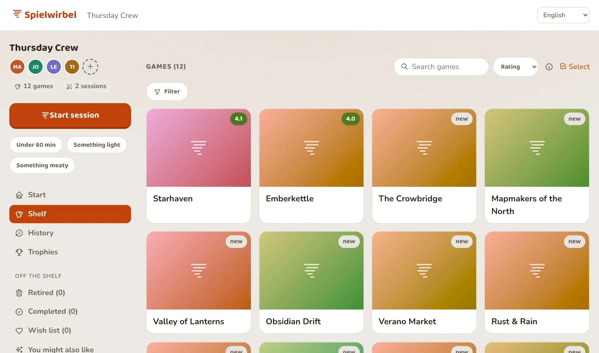

<p align="center">
  
</p>

<h1 align="center">Spielwirbel</h1>

[](https://github.com/ChulioZ/spielwirbel/actions/workflows/ci.yml)
[](https://github.com/ChulioZ/spielwirbel/actions/workflows/lint.yml)
[](https://github.com/ChulioZ/spielwirbel/actions/workflows/secret-scan.yml)

**"What should we play tonight?"** — Spielwirbel draws a few games from your
group's shelf, collects everyone's rating — on one shared device, on their own
phones, or through a link — and
remembers what your round actually likes.

<p align="center">
  
</p>

Self-hostable, German + English + Spanish + French + Italian UI, no tracking. Try it without an account at
**[spielwirbel.app](https://spielwirbel.app)**.

> ℹ️ **Status: live as a public multi-tenant SaaS** — registration has been open
> at [spielwirbel.app](https://spielwirbel.app) since 2026-07-24, and a guest
> demo lets you look around without signing up at all.
> **Self-hosting defaults to local-only with no authentication** — if you run it
> that way, keep it on a trusted network you control, since there is no access
> control until you configure one
> ([`docs/configuration.md`](docs/configuration.md)).

## Quick start

**Node.js 22 or newer** is the only prerequisite (get it from
<https://nodejs.org/>; developed and tested on Node 26).

```bash
npm install
npm start          # or: node server.js
```

Open <http://localhost:3000> — that's it. From another device on your network,
use `http://<your-computer-ip>:3000` (find the IP with e.g.
`ipconfig getifaddr en0` on macOS).

Use a different port or data folder: `PORT=8080 npm start`,
`DATA_DIR=/path/to/data npm start`.

Everything else — PostgreSQL, object storage for covers, user accounts, the
guest demo, rate limits, the operator panel, Docker and deploying — is optional
and documented in [`docs/configuration.md`](docs/configuration.md).

## What it does

- **Rounds** — a group with a name and any number of member seats.
- **Games** — title, player range, custom tags, cover art. Adding one searches
  **BoardGameGeek** and fills in the details; or import your whole *owned*
  BoardGameGeek collection in one go.
- **Sessions** — pick who's playing, draw candidate games that fit the player
  count, then everyone rates them 1–5, from "not at all" to "absolutely". Pass
  one device around the table, rate from your own phone, or send a link to
  people with no account — mix all three in one evening. Votes stay sealed until
  the reveal.
- **Guests** — someone outside the group can join one session without becoming a
  member.
- **Teams** — members and guests can pair up for a session: a team counts as one
  player when the games are drawn, and wins together.
- **Ratings & trophies** — averages are computed live from session votes, with a
  winners' podium, streaks, a "gathering dust" tile and a taste retrospective.
- **Two archives** — games are never deleted by accident: *retired* (done with
  it) and *completed* (finished its content), both restorable.
- **A Wunschliste** — games *and expansions* the group wants but does not own
  yet, kept beside the shelf without ever turning up in a vote, importable
  from a BGG wishlist, and — where the instance enables it — showing what each
  one costs right now.
- **Recommendations** — "das könnte euch auch gefallen": games the round does
  *not* own, ranked against its own shelf, its own ratings and what it actually
  plays, using a local BoardGameGeek corpus. Plain weighted arithmetic — no AI, nothing invented —
  and every card says why it is there.
- **Per-round design**, custom tags, an installable **PWA** that works offline,
  shareable deep links, a **Freundeskreis** feed between accounts, and
  **passkey** sign-in (fingerprint, face or device PIN — alongside the password,
  never instead of it).

→ Full detail in [`docs/features.md`](docs/features.md).

## Documentation

| Document | What's in it |
| --- | --- |
| [`docs/features.md`](docs/features.md) | Every feature in detail |
| [`docs/architecture.md`](docs/architecture.md) | How it's built, and what every file is for |
| [`docs/configuration.md`](docs/configuration.md) | All environment variables, Docker, deployment |
| [`docs/deploy-railway.md`](docs/deploy-railway.md) | Step-by-step production deploy |
| [`CLAUDE.md`](CLAUDE.md) | The architecture constraints new work must respect |
| [`CONTRIBUTING.md`](CONTRIBUTING.md) | How to contribute, and the licensing terms |
| [`SECURITY.md`](SECURITY.md) | Reporting a vulnerability |
| [`docs/legal/`](docs/legal/) | Operator records: DSA workflow, retention, DSAR |

## Development

```bash
npm test              # automated tests (Node's built-in runner + supertest)
npm run coverage:ci   # tests + the coverage thresholds CI gates on
npm run lint          # ESLint (flat config)
npm run check:syntax  # node --check over all JS files
npm run build         # optional: content-hash + minify js/css into dist/
npm run migrate       # apply pending Postgres migrations (needs DATABASE_URL)

node scripts/seed-dev.js   # fill a throwaway .devdata/ with a demo round
```

There is **no build step for development** — `npm start` serves `public/`
directly. `npm run build` is optional and only for production; see
[`docs/architecture.md`](docs/architecture.md).

## Contributing

This project is built and maintained with
[Claude Code](https://claude.com/claude-code), and the repository ships the
workflow with it: **skills** in `.claude/skills/` and **rules** in
`.claude/rules/` that encode how work gets done here. Whether you contribute by
prompting Claude Code or by hand, that is the intended path.

See **[`CONTRIBUTING.md`](CONTRIBUTING.md)** for where to start, the skill
workflow, translations, and the **contribution-licensing terms** — inbound
contributions are licensed under Apache-2.0 and every commit must be signed off
under the Developer Certificate of Origin (`git commit -s`).

## Data & backup

By default everything lives in the `data/` folder (`data.json` + `uploads/`) —
copy it to back up, delete it to reset. The whole folder is git-ignored, so your
group's data is never committed.

Set `DATABASE_URL` (and optionally `S3_BUCKET`) and your data lives in Postgres
and object storage instead — then **backups are your provider's job, and they are
usually not switched on by default.** Check, rather than assuming a managed
database backs itself up; see [`docs/configuration.md`](docs/configuration.md).

## About this project

This project was **developed entirely by Claude** (Anthropic's AI models, via
Claude Code), through an interactive, conversational process: a human described
the desired features and gave feedback, and Claude designed and wrote all of the
code, comments and documentation. It stands as a small example of what agentic,
AI-assisted development can produce end to end.

Note the distinction: the app's *development* was AI-driven, but the app itself
contains no AI and sends no data anywhere when you run it.

## License

[PolyForm Noncommercial License 1.0.0](LICENSE), © 2026 Julian Zenker — the sole
rights holder and licensor. The source is public and you are free to use, study,
modify and share it for **noncommercial** purposes (personal use, hobby
projects, education, research). Commercial use — including running it as a paid
or revenue-generating hosted service — is not granted by this license; contact
the maintainer for commercial terms.
